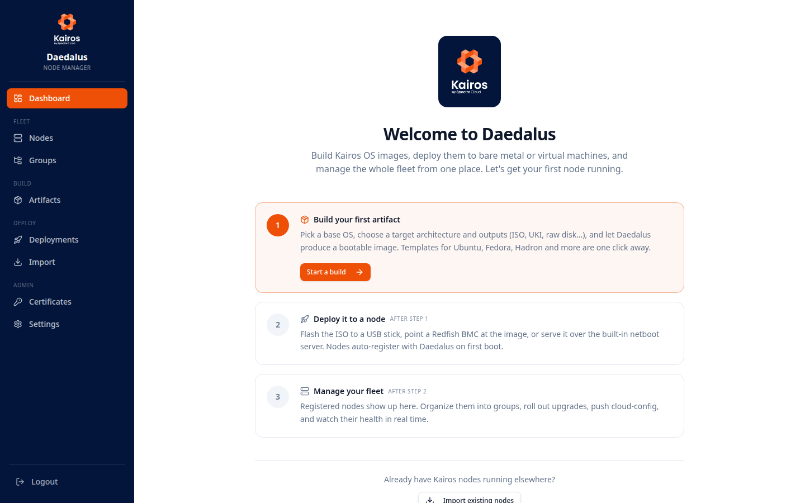

<p align="center">
  
</p>

<h1 align="center">AuroraBoot</h1>
<p align="center">
  <strong>The Kairos bootstrapper — build images, provision machines, manage the fleet.</strong>
</p>

<p align="center">
  <a href="https://opensource.org/licenses/"></a>
  <a href="https://github.com/kairos-io/AuroraBoot/issues"></a>
  <a href="https://kairos.io/docs/" target="_blank"></a>
  
  
</p>

AuroraBoot is the official bootstrapper for [Kairos](https://kairos.io). With a single binary you can:

- **Build** bootable images — ISO, UKI, raw disks, sysextensions — from any Kairos flavor or container image.
- **Provision** machines over the network via PXE/netboot, Redfish, or plain USB.
- **Customize** installation media with cloud-configs so machines install themselves unattended.
- **Manage** a whole fleet from a browser once nodes come online.

Two ways to run it, same binary:

1. **One-shot CLI** — `auroraboot build-iso`, `auroraboot build-uki`, `auroraboot netboot`, … for quick builds and scripted pipelines.
2. **Fleet server** — `auroraboot web` (or `docker compose up`) gives you a self-hosted dashboard, REST API, node manager, SecureBoot key store and netboot server, all in one place.

---

## Getting started with the fleet server

```bash
git clone https://github.com/kairos-io/AuroraBoot
cd AuroraBoot
docker compose up --build -d
```

On first boot AuroraBoot generates an admin password and a node registration token under `./data/secrets/`:

```bash
cat data/secrets/admin-password
cat data/secrets/registration-token
```

Open **http://localhost:9099**, sign in, and the welcome wizard walks you through the three steps: build an artifact, deploy it, manage the nodes that come online.

### What you get

- **A guided Artifact Builder** with ready-made templates for Ubuntu, Fedora, Debian, openSUSE, Alpine, Rocky and Hadron. Pick architecture, model, variant — the UI filters the choices so you only see what Kairos actually supports.
- **A deployment surface** — download the image, PXE-boot a rack of machines into it, hand it off to a Redfish BMC, or upgrade a node you already registered.
- **A node manager** — every machine AuroraBoot builds an image for phones home automatically and shows up in the Nodes list. From there you can send commands: upgrade, reboot, reset, apply a cloud-config, or run arbitrary shell with captured output.
- **A SecureBoot key store** for full PK / KEK / db sets plus TPM PCR policy keys, generated on demand and referenced by name from UKI builds. Keys can be exported as a signed archive and imported on another instance.
- **A REST API and Go client** mirroring the UI one-to-one, with Swagger UI at `/api/docs` and a first-class client at [`pkg/client`](pkg/client).

### Common settings

| Flag / env var | What it does |
|---|---|
| `--listen :8080` | HTTP listen address |
| `--data-dir ./data` | Where the DB, artifacts, keys and secrets live |
| `--db <dsn>` | Override DB DSN (SQLite by default, Postgres supported) |
| `--url https://…` | External URL of this instance, injected into cloud-configs so nodes know where to phone home |
| `AURORABOOT_ADMIN_PASSWORD` | Override admin password |
| `AURORABOOT_REG_TOKEN` | Override registration token |

See the full [AuroraBoot reference](https://kairos.io/docs/reference/auroraboot/) for everything else.

---

## Using the CLI

You don't need the fleet server to get value out of AuroraBoot. The historical one-shot CLI is fully preserved, and it's often all you need for a quick build or a one-off netboot.

### Netboot a machine from a Kairos release

Run this on a machine on the same network as the target, and let the target PXE-boot:

```bash
docker run --rm -ti --net host quay.io/kairos/auroraboot \
    --set "artifact_version=v2.4.2" \
    --set "release_version=v2.4.2" \
    --set "flavor=rockylinux" \
    --set "flavor_release=9" \
    --set "repository=kairos-io/kairos" \
    --cloud-config /path/to/cloud-config.yaml
```

This downloads the needed artifacts, bakes your cloud-config into a custom ISO, and serves it over the network.

### Use a container image instead

Point AuroraBoot at any Kairos container image (or your own) and it will boot that:

```bash
docker run --rm -ti --net host quay.io/kairos/auroraboot \
    --set container_image=quay.io/kairos/rockylinux:9-core-amd64-generic-v2.4.2
```

Add `-v /var/run/docker.sock:/var/run/docker.sock` if you want to use an image already sitting in your local Docker daemon instead of pulling from a remote.

### Cross-architecture builds

When pulling images for a different architecture than the host, set `arch`:

```bash
docker run --rm -ti --net host quay.io/kairos/auroraboot \
    --set container_image=quay.io/kairos/alpine:3.21-standard-arm64-rpi4-v3.6.0 \
    --set arch=arm64
```

Supported: `amd64` (default) and `arm64`.

### Offline ISO, no netboot

To generate an ISO without starting the PXE server, pass `disable_netboot=true`:

```bash
docker run -v /var/run/docker.sock:/var/run/docker.sock --rm -ti --net host \
    quay.io/kairos/auroraboot \
    --set container_image=quay.io/kairos/rockylinux:9-core-amd64-generic-v2.4.2 \
    --set disable_netboot=true
```

### Configuration file

Everything on the `--set` flag can also live in a YAML file:

```yaml
artifact_version: "v2.4.2"
release_version: "v2.4.2"
container_image: "..."
arch: "amd64"
flavor: "rockylinux"
flavor_release: "9"
repository: "kairos-io/kairos"

cloud_config: |
  #cloud-config
  install:
    device: "auto"
    auto: true
    reboot: true
  users:
    - name: kairos
      passwd: kairos
```

Passing `-` to `--cloud-config` reads it from stdin, which is handy in CI pipelines.

### Other subcommands

```bash
# Build an ISO from a Kairos release
auroraboot build-iso --image quay.io/kairos/ubuntu:24.04-core-amd64-generic-v3.6.0 \
    --output ./out --name kairos.iso

# Build a UKI from a container image
auroraboot build-uki --image quay.io/kairos/ubuntu:24.04-standard-amd64-generic-v3.6.0 \
    --output-dir ./out

# Generate a SecureBoot key set
auroraboot genkey my-keys --output ./keys

# Generate a sysextension from a container image
auroraboot sysext my-ext quay.io/myorg/my-tool:latest

# Redfish-driven deploy to a BMC
auroraboot redfish --endpoint https://bmc/redfish/v1 --user admin --pass secret --image kairos.iso

# Extract netboot artifacts from an ISO
auroraboot netboot kairos.iso ./netboot-out
```

Run `auroraboot help` for the full list.

### Experimental

- [Redfish deploy notes](./redfish.md)

---

## Under the hood

- **One binary, one container.** Go backend, React frontend bundled into the binary at build time and served by the same process. SQLite by default, Postgres optional.
- **CLI and fleet server share the same image factory.** Both call `deployer.Deploy`, `pkg/uki.Build` and `pkg/secureboot.GenerateKeySet` in-process — whatever the CLI builds, the server builds the same way, and streams the logs into the dashboard as they come out of the deployer.
- **Nodes auto-register** via the `phonehome:` cloud-config stage baked into every artifact AuroraBoot produces. First boot → node shows up in the UI. The artifact builder also bakes an explicit `allowed_commands` list (default: `upgrade`, `upgrade-recovery`, `reboot`, `unregister`); tick the destructive checkboxes — `exec`, `reset`, `apply-cloud-config` — only on fleets where you need them.
- **Deleting a node** runs a remote teardown: AuroraBoot sends an `unregister` command, the agent stops the phone-home service and drops its credentials + cloud-config files, then the DB record is removed. The UI shows live progress. For offline nodes, SSH in and run `kairos-agent phone-home uninstall` to do the same teardown by hand before force-deleting the record.

---

## Development

```bash
# Backend (Go 1.26+)
go build ./...
go test ./...

# Frontend (Node 22+)
cd ui
npm install
npm run dev     # Vite dev server on :5173, proxies /api to :8080
npm run build
npm test

# Regenerate the OpenAPI spec
make openapi

# Local Docker build
docker build -t quay.io/kairos/auroraboot:local .
# Skip the Swagger stage for faster iteration:
docker build --build-arg=SWAGGER_STAGE=without-swagger -t quay.io/kairos/auroraboot:local .
```

---

## Documentation & links

- [Kairos documentation](https://kairos.io/docs/) — the underlying OS
- [Getting started with Kairos](https://kairos.io/docs/getting-started)
- [AuroraBoot reference](https://kairos.io/docs/reference/auroraboot/) — full CLI reference
- [Examples](https://kairos.io/docs/examples)
- [Community](https://kairos.io/community/)

---

## License

Apache 2.0 — see [LICENSE](LICENSE).
